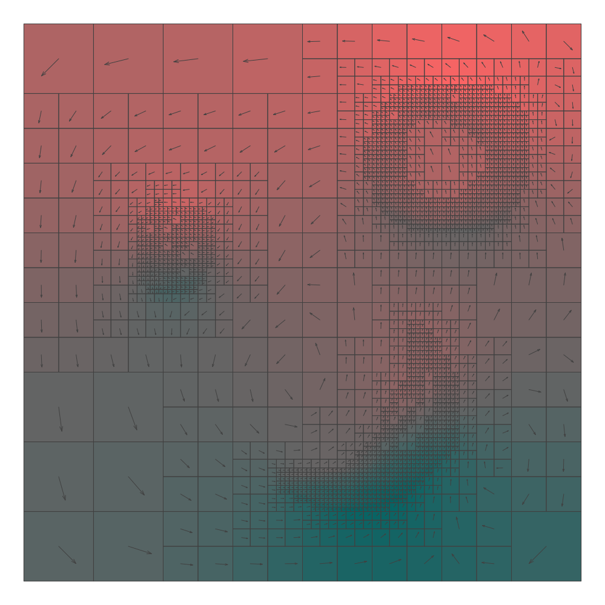

This post follows on from the [previous one](https://www.rncm.ac.uk/research/research-centres-rncm/prism/prism-blog/prism-residency-update-patrick-sanan/) to describe the creative use of adaptive mesh refinement algorithms to create art.

We will walk through how code developed during the residency can be used in a simple way to generate interesting signals, and give a simple of example of using such a signal to contro synthesis parameters.

A Julia project including a tutorial Jupyter notebook with many more details on this example is available [on GitHub](https://github.com/psanan/PRiSM_tool), with quickstart instructions to run the included Jupyter notebook.

## Defining the Problem

We begin with an arbitrary image, the darkness of which is used to define both density to drive a fluid flow, and regions
to be refined in the mesh.

## Solving the Equations

Our software provides a convenient way to leverage the powerful underlying p4est library to refine the unit square and assign degree of freedom (DOF) numbering appropriate for solving the Stokes equations.

We can also solve the equations of [Stokes Flow](https://en.wikipedia.org/wiki/Stokes_flow), providing a velocity and pressure field.

## Pushing Particles

A common computational technique is to advect passive particles with the flow.

The experience of each of these particles as it moves through the flow can be traced.

## Generating Signals

We can keep track of position, pressure, or other quantities for each particle over time.

## Making sound!

Each of these particles can be used to generate a signal used for compositional purposes. As an example, here I create a simple text output. The x position in the plane is used to control pan and and the pressure to control filter resonant frequencies for several synthesizer voices generated with with SuperCollider .

See the [SuperCollider source code](https://github.com/psanan/PRiSM_Tool/blob/main/play_trace.scd)
and listen to the 
[🔈 resulting audio](traces_2023-07-30.mp3)!

## Ongoing work

The approach here works as well in 3D, and we're using this as the basis for an audiovisual installation, where information is transported on a 3D non-uniform mesh.

## Acknowledgements

Many thanks to [Emily Howard, Dave De Roure, Marcus du Sautoy, Chris Melen, and Sam Salem](https://www.rncm.ac.uk/research/research-centres-rncm/prism/prism-team/prism-team/)at PRiSM, and to my [fellow residents, Rose Pritchard, Abi Bliss, and Leo Mercer](https://www.rncm.ac.uk/research/research-centres-rncm/prism/prism-team/prism-writers-and-scientists-in-residence/). Thanks to the GridAP project for their [p4est Julia wrapper](https://github.com/gridap/P4est_wrapper.jl) and to my collaborators on the [GPU4GEO project](https://www.pasc-ch.org/projects/2021-2024/gpu4geo/index.html).